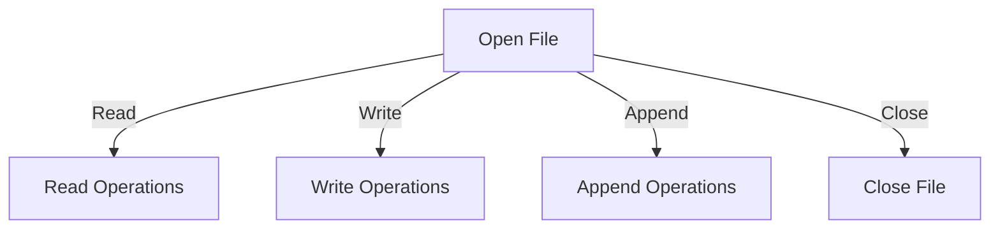

## Topic 1: File Operations in Python

### Introduction
File handling in Python allows users to create, read, write, and manipulate files easily. Python provides built-in functions to handle file operations using the `open()` function.

### File Operations
The major operations that can be performed on a file include:
1. **Opening a File** - `open(filename, mode)`
2. **Reading a File** - `read()`, `readline()`, `readlines()`
3. **Writing to a File** - `write()`, `writelines()`
4. **Appending to a File** - `append()`
5. **Closing a File** - `close()`

### File Modes
| Mode | Description |
|------|-------------|
| `'r'` | Read mode (default) |
| `'w'` | Write mode (overwrites existing content) |
| `'a'` | Append mode (adds content to existing file) |
| `'x'` | Exclusive creation mode (fails if file exists) |
| `'b'` | Binary mode |
| `'t'` | Text mode (default) |

### Example: Opening and Closing a File
```python
file = open("example.txt", "w")  # Open file in write mode
file.close()  # Close the file
```

### Example: Writing to a File
```python
with open("example.txt", "w") as file:
    file.write("Hello, Python File Handling!")
```

### Example: Reading from a File
```python
with open("example.txt", "r") as file:
    content = file.read()
    print(content)
```

### Example: Reading a File Line by Line
```python
with open("example.txt", "r") as file:
    for line in file:
        print(line.strip())  # Strip removes newline characters
```

### Example: Using `readline()` to Read One Line at a Time
```python
with open("example.txt", "r") as file:
    line1 = file.readline()
    line2 = file.readline()
    print(line1, end='')
    print(line2, end='')
```

### Example: Using `readlines()` to Read All Lines as a List
```python
with open("example.txt", "r") as file:
    lines = file.readlines()
    print(lines)  # Outputs a list of lines
```

### Example: Appending to a File
```python
with open("example.txt", "a") as file:
    file.write("\nAppending this line.")
```

### Example: Writing Multiple Lines using `writelines()`
```python
lines = ["Line 1\n", "Line 2\n", "Line 3\n"]
with open("example.txt", "w") as file:
    file.writelines(lines)
```

### Mermaid Diagram


 
