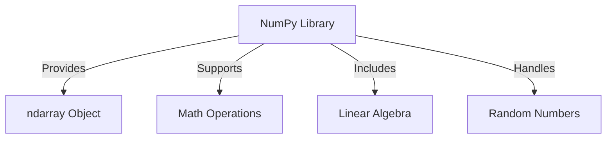

## Topic 1: NumPy in Python

### Introduction
NumPy (Numerical Python) is a fundamental library for numerical computing in Python. It provides support for large, multi-dimensional arrays and matrices, along with mathematical functions to operate on these arrays efficiently.

### Key Features of NumPy:
- Provides multi-dimensional array objects (`ndarray`)
- Performs fast mathematical operations on arrays
- Supports broadcasting for efficient computation
- Offers functions for linear algebra, Fourier transform, and random number generation

### Installing NumPy
To use NumPy, install it using pip:
```bash
pip install numpy
```

### Creating NumPy Arrays
```python
import numpy as np

# Creating a 1D array
arr1 = np.array([1, 2, 3, 4, 5])
print("1D Array:", arr1)

# Creating a 2D array
arr2 = np.array([[1, 2, 3], [4, 5, 6]])
print("2D Array:\n", arr2)
```

### Array Attributes
```python
print("Shape of arr2:", arr2.shape)  # (2,3)
print("Size of arr2:", arr2.size)    # 6
print("Data type of arr2:", arr2.dtype)
```

### NumPy Array Operations
```python
# Element-wise operations
arr = np.array([10, 20, 30])
print("Addition:", arr + 5)
print("Multiplication:", arr * 2)
print("Square:", arr ** 2)
```

### Generating Special Arrays
```python
# Zeros array
zeros = np.zeros((3, 3))
print("3x3 Zero Matrix:\n", zeros)

# Ones array
ones = np.ones((2, 2))
print("2x2 Ones Matrix:\n", ones)

# Random array
randoms = np.random.rand(3, 3)
print("3x3 Random Matrix:\n", randoms)
```

### Indexing and Slicing in NumPy
```python
arr = np.array([10, 20, 30, 40, 50])
print("First element:", arr[0])
print("Last two elements:", arr[-2:])
```

### Mermaid Diagram


NumPy is an essential library for efficient numerical computations in Python, making it a core component of data analysis and machine learning workflows.

